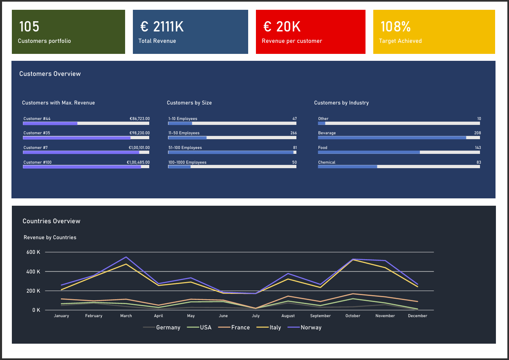

# Sales KPI Analysis (Excel Project)

---

## 📸 Preview

---

## Project Overview
This project analyzes key performance indicators (KPIs) for sales data using Microsoft Excel.  
The dashboard provides insights into revenue, sales trends, and customer behavior.

---

## Features
- Interactive Excel dashboard
- Monthly & yearly sales trends
- Top-performing products & regions
- KPI cards for quick performance view

---

## Tools Used
- Microsoft Excel
- Pivot Tables
- Charts & Conditional Formatting

---

## Files in this Repository
- `Sales_KPI_Analysis.xlsx` — Main Excel dashboard
- `README.md` — Project documentation

---

## How to Use
1. Download the `.xlsx` file from this repo.
2. Open in Microsoft Excel (or compatible software).
3. Explore the interactive dashboard and KPI metrics.